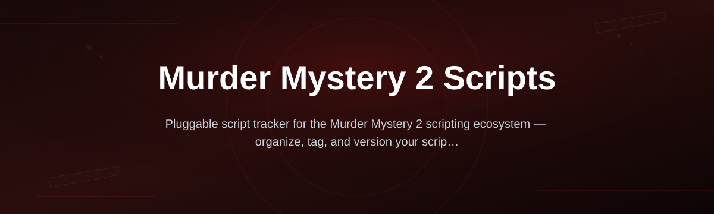
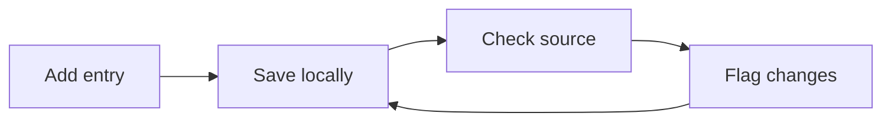

# mm2-script-tracker

*A calmer way to keep track of Murder Mystery 2 scripts without digging through ten Discord servers.*

## What this is

**mm2-script-tracker** is a lightweight Windows tool built for people who follow Murder Mystery 2 scripts and want one place to see what's active, what's outdated, and what's worth checking out. Instead of bookmarking scattered Pastebin links or scrolling through Discord history, you get a local list that updates itself and tells you when something changes.

This isn't a script hub and it doesn't run anything inside Roblox. It's a tracker — think of it as an organized shelf for the links and metadata around Murder Mystery 2 scripts, so you spend less time hunting and more time knowing what's current.

  

The button above opens the project's landing page, where you download the current build.

## Who it is for

- **Players who follow MM2 script channels** and want fewer tabs open
- **Server mods** who need a clean reference for what's floating around
- **Script curators** tracking version history across sources
- **Returning players** who left MM2 for a while and want to catch up fast
- **Anyone tired of dead Pastebin links** breaking their bookmarks

## What you can do

- **Track multiple scripts** in one local list, sorted by last-seen date
- **Get notified** when a tracked entry changes or goes offline
- **Tag entries** by source, status, or your own notes
- **Filter by activity** — see what's been updated recently vs. stale
- **Export your list** as plain text or CSV for sharing
- **Run fully offline** once your list is loaded — no background pings
- **Keep history** of what changed and when, per entry
- **Import a starter list** to skip manual setup

## Getting started

1. Open the landing page using the download button above.
2. Download the latest Windows build (no installer needed).
3. Unzip it anywhere — no admin rights required.
4. Run the `.exe` and add your first tracked entries.
5. Check back periodically; the tracker flags anything that's changed.

## Requirements

- Windows 10 or 11 (64-bit)
- No Python, Node, or build tools required
- Runs standalone — nothing to compile
- Internet connection only needed for update checks

## How it works

The tracker keeps a local record for each entry and periodically checks if the source has changed, then updates its status.

1. You add a script entry with a name and source link.
2. The tracker stores it locally with a timestamp.
3. On each check, it compares current state to the saved one.
4. Anything different gets flagged in the list.
5. You review, tag, or remove entries as needed.

## FAQ

**Is this a script itself, or does it run scripts?**
No. It only tracks metadata about Murder Mystery 2 scripts — links, status, notes. It doesn't execute anything.

**Does it work with Roblox directly?**
No integration with Roblox or MM2 itself. It's a separate desktop tool for organizing information.

**Why do MM2 script links break so often?**
Hosting sites frequently take down pages, scripts get updated under new links, or creators rotate sources. That churn is exactly what this tool tracks.

**Can I use this on Mac or Linux?**
Not currently. The build targets Windows 10/11 only.

**Will this get me banned in MM2?**
The tracker doesn't touch the game or inject anything, so it carries no in-game risk by itself.

## Troubleshooting

**App won't open on launch**
Right-click the `.exe` → Properties → check "Unblock" if present, then relaunch.

**Entries aren't updating**
Confirm you have an active internet connection; offline mode only shows cached data.

**List file seems corrupted**
Delete the local data file and reimport your list — the app rebuilds it from scratch.

**Windows flags the file as unrecognized**
This is common for small, unsigned Windows tools. Verify you downloaded from the official landing page before proceeding.

## License

Released under the [MIT License](LICENSE). This project is provided as-is, with no warranty. It tracks publicly available information and does not host, modify, or distribute scripts itself.

  

